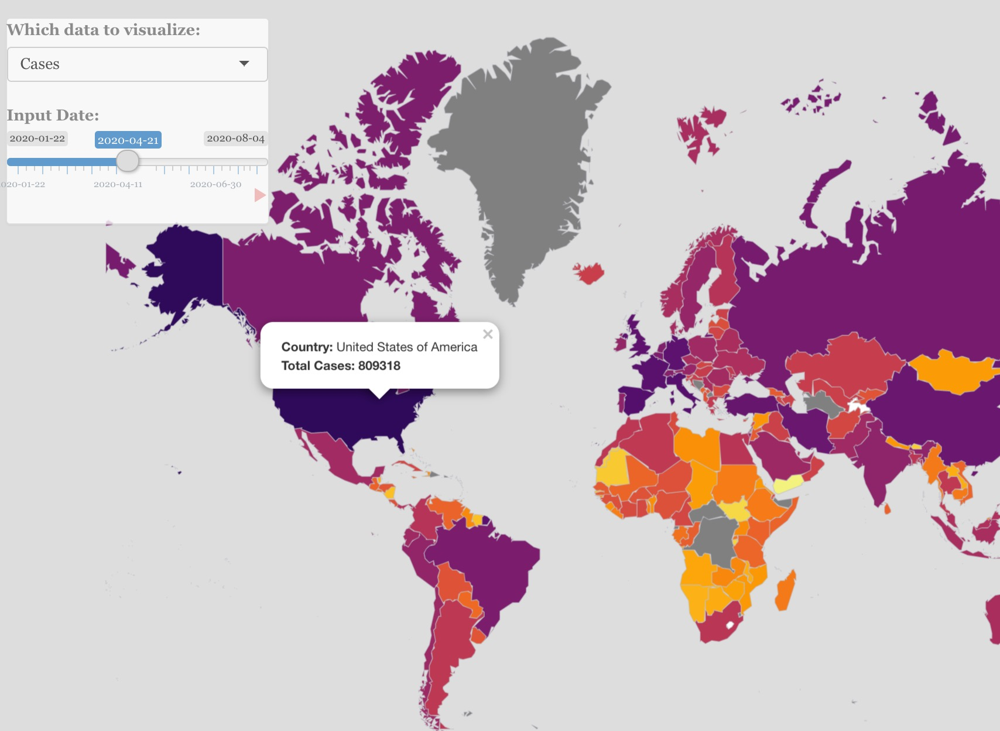

# Project 2: Shiny App Development

### [Project Description](doc/project2_desc.md)



In this second project of GR5243 Applied Data Science, we develop a *Exploratory Data Analysis and Visualization* shiny app on a topic of your choice using [JHU CSSE Covid-19 Data](https://github.com/CSSEGISandData/COVID-19) or NYC Health open data released on the [NYC Coronavirus Disease 2019 Data](https://github.com/nychealth/coronavirus-data) website. See [Project 2 Description](doc/project2_desc.md) for more details.  

The **learning goals** for this project is:

- business intelligence for data science
- study legacy codes and further development
- data cleaning
- data visualization
- systems development/design life cycle
- shiny app/shiny server

*The above general statement about project 2 can be removed once you are finished with your project. It is optional.

## Project: US Covid-19 Policy Tracker
Term: Fall 2020

+ Group 8
+ **US Covid-19 Policy Tracker**: Presented by:
	+ Zihan Chen
	+ Rohan Uppuluri
	+ Jiaqi Yuan
	+ Xujie Ma

+ **Project summary**: In this project, we built a policy tracker to explore the interaction of state government policy response and Covid-19 statistics overtime (from 01/22/20 to 10/12/20). In particular, we want to see how some key Covid-19 statistics (confirmed cases, death, infection rate, mortality rate, positive test rate, hospitalization rate) change overtime and how the state governments are publishing corresponding containment and closure policies, health system policies, and economic policies. Business Value: Our project provides the interactive plot of state government policy and Covid-19 statistics, and it could help to answer questions such as:
	1. How did policy stringency change with the evolving situation?
 	2. How Covid-19 statistics change after policy stringency change?


+ **Contribution statement**: All team members contributed equally in all stages of the project and everyone approved our work presented in Github repository including this contribution statement. 
	
	Rohan Uppuluri did the data pre-processing for merging and cleaning the JHU and Oxford datasets. Rohan also worked on the interactive trend 	plot with Jiaqi and did the presentation for the app.

	Xujie Ma developed a version of US map and state map by using mapview and created the interactive interface of the map.

	Jiaqi Yuan worked on the home tab and reference tab for project description. She also worked on the interactive trend plot with Rohan and 	recode some of the variables for data processing. 

	Zihan Chen took major responsibility in implementing the state level map and the county level map. 

Following [suggestions](http://nicercode.github.io/blog/2013-04-05-projects/) by [RICH FITZJOHN](http://nicercode.github.io/about/#Team) (@richfitz). This folder is orgarnized as follows.

```
proj/
├── app/
├── lib/
├── data/
├── doc/
└── output/
```

Please see each subfolder for a README file.

